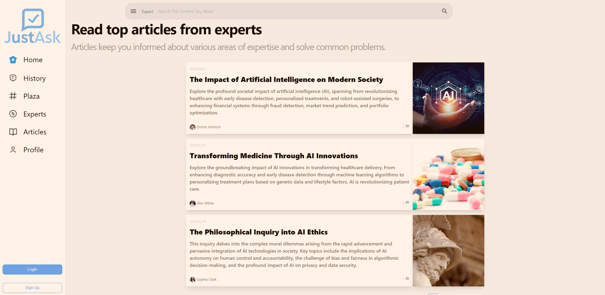
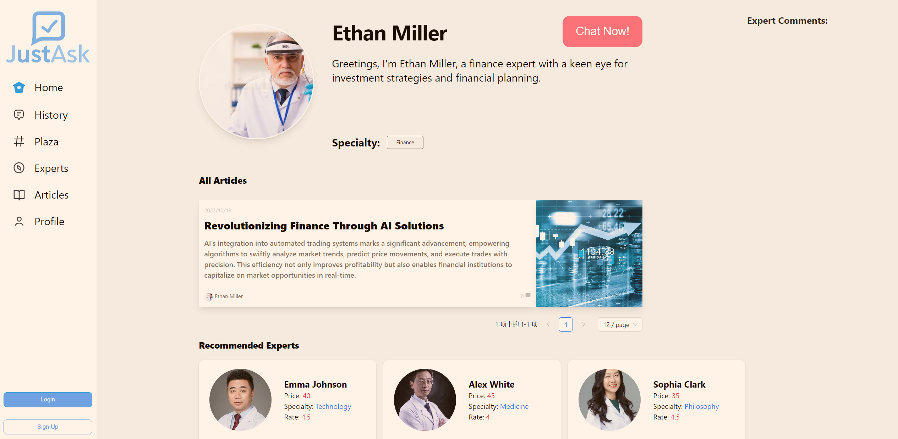
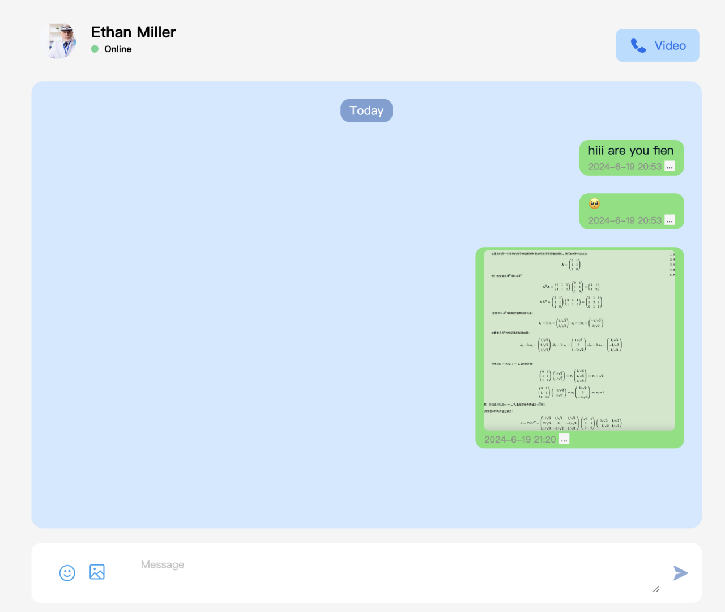
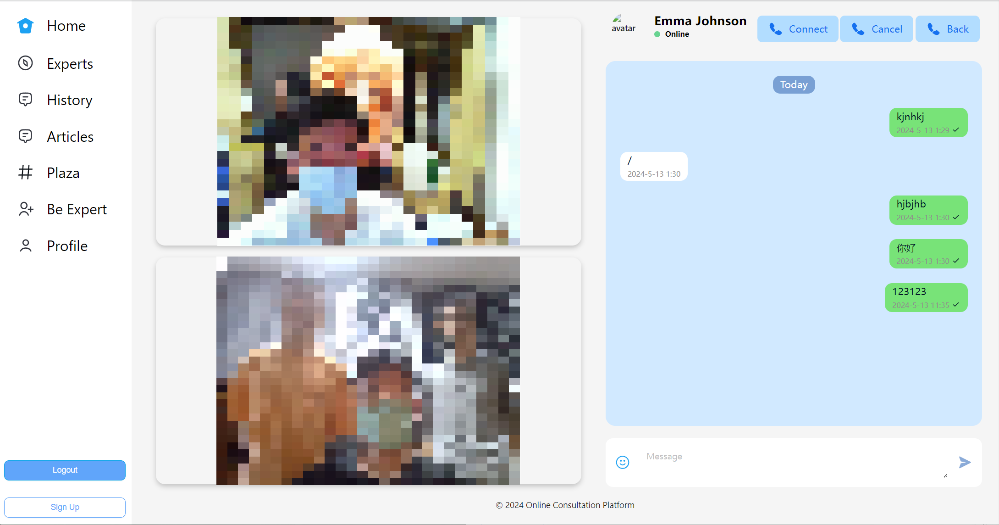

# JustAsk

<p align="center">

</p>

随着互联网的发展，网络用户常常希望在网络平台上解决专业性问题，这也导致咨询平台是需求量较大的一类网络交流平台。其中的代表有**知乎**以及各种特定领域内的咨询平台。然而鲜有集多领域咨询功能于一体的专业咨询平台，现存的多领域咨询平台也往往在专业性等方面有所欠缺，也导致这类平台并没有广泛使用。

JustAsk 是一个**多领域线上一对一咨询平台**，旨在实现高专业性、多领域的可靠咨询交流，为用户提供方便的咨询服务，为专家提供传播专业知识的平台。

## 界面预览

<p align="center">

</p>

<p align="center">

</p>

<p align="center">

</p>

<p align="center">

</p>

<p align="center">

</p>

<p align="center">

</p>

- 支持发布动态、发布文章、与专家进行文字咨询或视频咨询等功能

## 技术架构

- 界面设计：使用 figma 的 buider.io 插件实现 AI 帮助转换界面组件为代码 提高生产力
- 前端：React+Vite 框架

  使用了 for-editor 库实现 md 文档编辑器

- 后端：Spring Boot + JPA 框架

- 数据库：MySQL 关系型数据库

- 咨询功能：使用 **webRTC** 实现视频咨询功能 使用 **websocket** 实现文字聊天功能

- 传输协议：使用自签名证书配置 ssl 升级协议为 https 和 wss 保证传输安全性

## 开始使用(如何在本地环境部署)

### 前端

打开 frontend 文件夹

安装依赖

```bash
$ npm install
```

在本地环境运行前端 默认运行在 5173 端口

```bash
$ npm run dev
```

### 后端

建议使用 IDEA 打开 backend 文件夹 运行主类即可部署后端在本地环境 默认运行在 8080 端口

如需改变端口等环境变量 可以在 backend 下添加.env 文件覆盖默认参数

因为自签名证书通常会被浏览器所隔离 可能会出现“failed to fetch”的情况 解决方法：先通过浏览器直接访问后端的静态资源 点击信任网站 之后即可正常浏览

### 数据库

若要使用我们提供的示例数据以及图片 可以在本地的 MySQL 创建名为 `ocp` 的数据库 并运行 `ocp.sql` 脚本以导入示例数据 之后即可在本地环境下正常展示

## 贡献者(顺序不分先后)

- [Horizon12275](https://github.com/Horizon12275)
- [Sharkyesc](https://github.com/Sharkyesc)
- [JoyceQqi](https://github.com/JoyceQqi)
- [Seriousss](https://github.com/Seriousss)
- [关于 - nwdnysl](https://nwdnys1.github.io/about)
